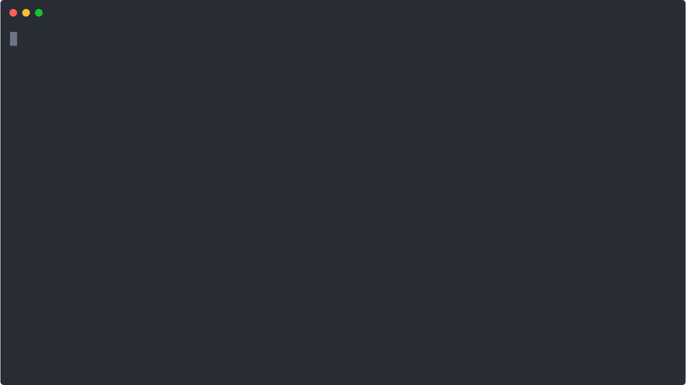

# cfpush

>an interactive Cloud Foundry tutorial in your terminal



The tutorial will walk and talk you through the deployment of a simple chat application to Cloud Foundry while exploring cloud-native apps.

Just run:
```bash
docker run -it mamachanko/cfpush
```

or clone this repository and run:
```bash
./run.sh
```

You're feedback is very welcome. Feel free to raise an issue if anything should be unclear or you run into any problems.

We manage our backlog [here](https://pivotaltracker.com/n/projects/2315492).

## Prerequisites

This tutorial currently assumes you're using [run.pivotal.io](https://run.pivotal.io). If you sign up you will get some free quota to play around with. (might as well spend it on this tutorial)

## Development affordances

You can run the tutorial with different flavours:
```bash
# For the tutee. With prompts and real commands. It's the tutorial as it's meant to be run.
./run.sh

# For CI. non-interactive and with smoke tests.
CI=true ./run.sh

# For writing the tutorial with pretend commands.
DRY=true ./run.sh
```

Run the message-service with an in-memory database:
```bash
./scripts/run-message-service.sh
```

Run the message-service with Postgres:
```bash
docker-compose --file message-service/docker-compose.yml up -d 
./scripts/run-message-service.sh -Dspring.profiles.active=postgres
```

Run the chat-app:
```bash
./scripts/run-chat-app.sh
```

Utility scripts for testing and introspection:
```bash
# list messages
./scripts/get-messages.sh # defaults to localhost:8080
./scripts/get-messages.sh 'message-service.cfapps.io'

# create a random message
./scripts/post-message.sh # defaults to localhost:8080
./scripts/post-message.sh 'message-service.cfapps.io'
```

More utilities in `./scripts`:
```bash
# reset the tutorial by deleting the space
./scripts/clean-tutorial.sh

# build the apps
./scripts/builds.sh

# build the apps, run the tutorial in non-interactive mode and push the code
./scripts/ship.sh
```

## Object of study: "a (very) simple chat"

> TODO: this section should become redundant if properly explained within the tutorial 

The object of study is a simple chat application. The frontend is a Javascript React application, the `chat-app`. The backend is a Java Spring Boot web application, the `message-service`.
The `chat-app` continuously polls `message-service` for messages and allows you to create new messages. This is not a great
architecture for a chat application. And you are urged not to take pointers for production-ready application design. 
But it serves the purpose of exploring Cloud Foundry and cloud-native computing.

### the backend - `message-service`
It's a Java Spring Boot web application. It exposes two endpoints:

    GET  /api/messages : returns list of messages
    POST /api/messages : creates a new message

### the frontend - `chat-app`
This is a Javascript React application. 
It continuously polls the `message-service` for messages and allows you to send new messages to it.
It will tell you if it fails to reach the `message-service`.
